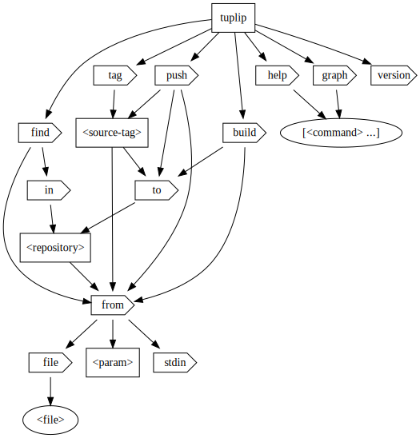

# tuplip

[](https://travis-ci.com/gofunky/tuplip)
[](https://godoc.org/github.com/gofunky/tuplip)
[](https://goreportcard.com/report/github.com/gofunky/tuplip)
[](https://www.codacy.com/app/gofunky/tuplip?utm_source=github.com&amp;utm_medium=referral&amp;utm_content=gofunky/tuplip&amp;utm_campaign=Badge_Grade)
[](https://renovatebot.com/)
[](https://github.com/gofunky/tuplip/blob/master/LICENSE)
[](https://github.com/gofunky/tuplip/commits/master)
[](https://microbadger.com/images/gofunky/tuplip "Docker Version")
[](https://microbadger.com/images/gofunky/tuplip "Docker Layers")
[](https://hub.docker.com/r/gofunky/tuplip)

tuplip generates and checks Docker tags in a transparent and convention-forming way

<!-- toc -->

- [Installation](#installation)
  * [Get the binary](#get-the-binary)
  * [Get the library](#get-the-library)
  * [Using Docker](#using-docker)
- [Using tuplip](#using-tuplip)
  * [Using the binary](#using-the-binary)
  * [Using the library](#using-the-library)
  * [Using Docker](#using-docker-1)
- [Commands](#commands)
  * [build](#build)
  * [tag](#tag)
  * [push](#push)
  * [find](#find)
- [Input](#input)
  * [Unversioned Alias Tag Vectors](#unversioned-alias-tag-vectors)
  * [Versioned Dependency Tag Vectors](#versioned-dependency-tag-vectors)
  * [Versioned Root Tag Vectors](#versioned-root-tag-vectors)
- [Sources](#sources)
  * [From Standard Input](#from-standard-input)
  * [As Parameter](#as-parameter)
  * [From Dockerfile](#from-dockerfile)
- [Flags](#flags)
  * [exclude-major](#exclude-major)
  * [exclude-minor](#exclude-minor)
  * [exclude-base](#exclude-base)
  * [add-latest](#add-latest)
  * [exclusive-latest](#exclusive-latest)
  * [separator](#separator)
  * [root-version](#root-version)
  * [straight](#straight)
  * [filter](#filter)
  * [verbose](#verbose)

<!-- tocstop -->

## Installation

### Get the binary

```bash
go get -u github.com/gofunky/tuplip/cmd/tuplip
```

### Get the library

```bash
go get -u github.com/gofunky/tuplip
```

### Using Docker

```bash
docker pull gofunky/tuplip
```

## Using tuplip

### Using the binary

```bash
echo "dep _:1.0.0" | tuplip build from stdin
```

### Using the library

```golang
import "github.com/gofunky/tuplip/pkg/tupliplib"
```

### Using Docker

```bash
docker run --rm -i gofunky/tuplip build from dep _:1.0.0
```

## Commands



### build

`tuplip build` generates all possible tag representations that a given Docker image should receive.
By default, all tags are printed line by line to the `stdout`. Errors are printed to the `stderr`.

### tag

`tuplip tag` tags the given source image with all tags that the `build` command would generate.
A repository can be defined to be prefixed to the tags. Leave the argument out to use it without a repository. 
Docker needs to be installed. If you usually need `sudo` for the docker cli, also use `sudo` for `tuplip`.

```bash
sudo ~/go/bin/tuplip tag source-tag matfax/ignore from test _:0.0.1 -l
```

#### Processed Tags

```bash
latest
test
0
0.0
0.0.1
0-test
0.0-test
0.0.1-test
```

### push

`tuplip push` tags the given source image with all tags that the `build` command would generate,
and pushes them afterwards. Contrasted to `docker push org/repository`, this method ensures that only the intended
tags are pushed, and no accidentally pulled outdated ones with the same repository prefix.
Docker needs to be installed. If you usually need `sudo` for the docker cli, also use `sudo` for `tuplip`.
You need to be logged in to the Docker Hub for pushes (e.g., by calling `docker login`).

```bash
sudo ~/go/bin/tuplip push source-tag matfax/ignore from test _:0.0.2
```

#### Pushed Tags

```bash
matfax/ignore:0
matfax/ignore:0.0
matfax/ignore:0.0.2
matfax/ignore:test
matfax/ignore:0-test
matfax/ignore:0.0-test
matfax/ignore:0.0.2-test
```

### find

`tuplip find` works vice versa. Projects with larger dependency graphs are difficult to track.
This command helps you to find the most appropriate tag given your required dependency versions.
It finds the tag matching as many of your given dependencies as possible with as little overhead as possible. 
The Docker Hub repository to check can be any repository that follows the common convention.

#### Why it is necessary

If only few dependencies are defined, finding an appropriate image is no hassle.
However, the more vectors are given, the more possible variations in the vector order exist.
tuplip uses an alphabetical order (prioritizing root vectors), but other tags may use another order.
The `tuplip find` command not only checks the order, it also finds a suitable version variant. 

#### Examples

Let's assume we always want the latest git version but we require alpine 3.8.

```bash
tuplip find in gofunky/git from alpine:3.8
```

Then, the most appropriate image would be: 

```bash
alpine3.8
```

For those who are wondering now, why the output tag does not contain the version of git itself, the answer is that
according to a mostly-used Docker convention, all unmentioned dependencies implicitly equal the latest versions
since these images are always rebuilt. Only the versions explicitly defining an outdated dependency are not rebuilt
and preserve the defined versions.

Let's assume, we need git version 2.18.0 besides the given alpine version 3.8.

```bash
tuplip find gofunky/git from alpine:3.8
```

Then, the most appropriate image would be: 

```bash
2.18.0-alpine3.8
```

## Input

### Unversioned Alias Tag Vectors

Unversioned alias tag vectors describe dependencies without versions or special build parameters that define a separate output portion.

#### Example

```bash
echo "something fancy" | tuplip build from stdin
```

#### Result

```bash
something
fancy
fancy-something
```

### Versioned Dependency Tag Vectors

Versioned tag vectors describe dependencies with versions.
Given as such, the versions are altered and depicted in all their variants.

#### Example

```bash
echo "go:1.2.3" | tuplip build from stdin
```

#### Result

```bash
go
go1
go1.2
go1.2.3
```

### Versioned Root Tag Vectors

A versioned root tag vector is used to depict the different version representations of the project itself.

#### Example

```bash
echo "_:1.0 dep" | tuplip build from stdin
```

#### Result

```bash
1
1.0
dep
1-dep
1.0-dep
```

## Sources

### From Standard Input

Separate the tag vectors either by newlines or by spaces.

```bash
echo "something fancy" | tuplip build from stdin
```

### As Parameter

Separate the tag vectors by spaces.

```bash
tuplip build from something fancy
```

### From Dockerfile

#### Terminology

```Dockerfile
FROM org/image:tag as alias
```

#### Description

Define the tag vectors as `FROM` instructions in a Dockerfile.

```bash
tuplip find from file yourDockerfile
```

The advantage of using a Dockerfile is that you can use Dockerfile dependency update tools.
Instead of hard coding the Docker tags, you can let tuplip find the most appropriate one from
a Dockerfile in your project path. Once a pull request is created with an updated dependency
from a Docker repository, tuplip checks if the given image has an updated version.
Finally, you will have an immediate notification if dependencies are updated and if your
required Docker images have tags available that match them.   

```Dockerfile
FROM golang:1.11.4 as builder
FROM scratch as master
FROM gofunky/docker:18.09.0
ARG VERSION=2.4
ARG REPOSITORY=gofunky/ignore
```

The above Dockerfile shows an example. It could be a separate file just for version resolving.
Alternatively, one may also use an existing Dockerfile for a target image and build
the target tags from it. 

#### ARG Instructions

The `ARG` instruction that is called `VERSION` will be interpreted as the root tag vector version.
Alternatively, one may use the `--root-version`, or short `-r`, flag to override it.
If no root tag vector is required, simply remove the respective `ARG` instruction.

The target repository will be derived (e.g, the one to check using the `find` command)
from the `ARG` instruction that is called `REPOSITORY`.
If no target repository is required (e.g., for a `build` command), simply remove the respective `ARG` instruction.

#### Versioned FROM Instructions

All `FROM` instructions that contain a tag or version will be interpreted as dependency tag vectors.
The `image` name (without the `org`) will be used as alias by default.
This derived alias can be overridden by setting `scratch` as `image` name and setting a custom `alias` (e.g., `FROM scratch:0.1 as dep`).

#### Unversioned FROM Instructions

All other `FROM` instructions that do not contain a tag or version will be interpreted as alias tag vectors.
The `image` name (without the `org`) will be used as alias by default.
This derived alias can be overridden by setting `scratch` as `image` name and setting a custom `alias` (e.g., `FROM scratch as alias`).

#### Multiple Vectors per Instruction

Transitive multi-vector-tagged image dependencies will be interpreted correctly.
That means, `FROM gofunky/golang:1.11.0-alpine3.8 as builder` for instance,
will return the vectors `golang:1.11.0` and `alpine:3.8`.

#### Ignored Instructions

Any `FROM` instructions that use an alias with the prefix `i__` (e.g., `i__builder`) will be ignored.

## Flags

### exclude-major

`--exclude-major` or `-m` excludes the major versions (e.g., `go1` for `go:1.2.3`) from the considered version variants.

#### Example

```bash
echo "go:1.2.3" | tuplip build from stdin --exclude-major
```

#### Result

```bash
go
go1.2
go1.2.3
```

### exclude-minor

`--exclude-minor` or `-i` excludes the minor versions (e.g., `go1.2` for `go:1.2.3`) from the considered version variants.

#### Example

```bash
echo "go:1.2.3" | tuplip build from stdin --exclude-minor
```

#### Result

```bash
go
go1
go1.2.3
```

### exclude-base

`--exclude-base` or `-b` excludes the base alias (e.g., `go` for `go:1.2.3`) from the considered variants.

#### Example

```bash
echo "go:1.2.3" | tuplip build from stdin --exclude-base
```

#### Result

```bash
go1
go1.2
go1.2.3
```

### add-latest

`--add-latest` or `-l` adds the `latest` tag to the output set.

#### Example

```bash
tuplip build from _:1.2.3 --add-latest
```

#### Result

```bash
1
1.2
1.2.3
latest
```

### exclusive-latest

`--exclusive-latest` or `-e` makes the `latest` root tag vector version an exclusive tag if given.
This is especially useful for automated builds (e.g., Docker Hub builds) where the root tag vector version is passed from the build system.

#### Example

```bash
tuplip build from _:latest alias:1.2.3 --exclusive-latest
```

#### Result

```bash
latest
```

### separator

`--separator` or `-s` sets a different tag vector separator when reading from standard input.

#### Example

```bash
echo "something; fancy" | tuplip build from stdin --separator=";"
```

#### Result

```bash
something
fancy
fancy-something
```

### root-version

`--root-version` or `-r` overrides the root tag vector's version of the given Dockerfile.
It is available in the `from file` commands.

#### Example

```bash
tuplip build from file Dockerfile -f golang,docker,master -r 1.1.1 -m -i
```

#### Pushed Tags

```bash
docker-golang-master
docker-golang1.11.4-master
docker18.9.0-golang-master
docker18.9.0-golang1.11.4-master
1.1.1-docker-golang-master
1.1.1-docker18.9.0-golang1.11.4-master
1.1.1-docker18.9.0-golang-master
1.1.1-docker-golang1.11.4-master
```

### straight

`--straight` or `-s` lets tuplip use the input tags directly without any mixing.
It is available in the `tag` and `push` commands.

#### Example

```bash
tuplip push image to gofunky/ignore from foo goo -s
```

#### Pushed Tags

```bash
gofunky/ignore:foo
gofunky/ignore:goo
```

Notice that there is no `foo-goo` present since the given arguments are no tag vectors but simple input tags that are passed to docker.

### filter

`--filter` or `-f` excludes all tags without the given set of tag vectors from the output set.

#### Example

```bash
tuplip build from one two:0.1 three --filter one,two
```

#### Result

```bash
one-two
one-two0
one-two0.1
one-three-two
one-three-two0
one-three-two0.1
```

### verbose

`--verbose` or `-v` enables descriptive logging to the stderr.
Nevertheless, stdout will only receive the output tags to ensure a strict separation that
doesn't hinder any post-processing.

#### Example

```bash
tuplip push image to gofunky/ignore from foo goo -s --verbose
```

#### StdErr

```bash
{"level":"info","message":"queueing read from slice"}
{"level":"info","message":"queueing tagging","source tag":"image"}
{"level":"info","message":"execute","args":"docker"}
{"level":"info","message":"queueing push"}
{"level":"info","message":"execute","args":"docker"}
{"level":"info","message":"execute","args":"docker tag image gofunky/ignore:foo"}
{"level":"info","message":"tagged","tag":"gofunky/ignore:foo"}
{"level":"info","message":"fetching tags for remote repository","repository":"gofunky/ignore"}
{"level":"info","message":"execute","args":"docker tag image gofunky/ignore:goo"}
{"level":"info","message":"tagged","tag":"gofunky/ignore:goo"}
{"level":"info","message":"execute","args":"docker push gofunky/ignore:foo"}
{"level":"info","message":"pushed","tag":"gofunky/ignore:foo"}
{"level":"info","message":"fetching tags for remote repository","repository":"gofunky/ignore"}
{"level":"info","message":"execute","args":"docker push gofunky/ignore:goo"}
{"level":"info","message":"pushed","tag":"gofunky/ignore:goo"}
```

#### StdOut

```bash
gofunky/ignore:foo
gofunky/ignore:goo
```
